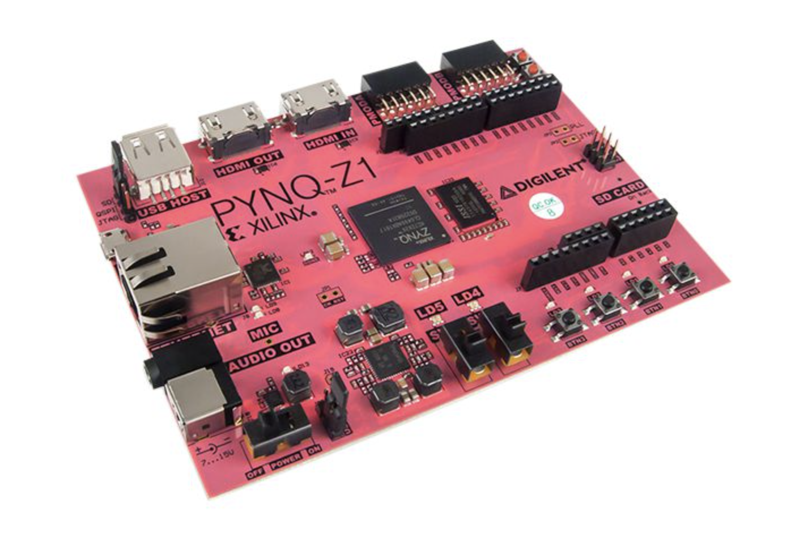

# Fast anomaly detection on a Xilinx Zynq SoC

In this tutorial, we will demonstrate how to design and deploy a fast and resource inexpensive anomaly detection algorithm on an FPGA, using the [ADC2021 challenge dataset](https://mpp-hep.github.io/ADC2021/).
In the first notebook we will design a quantized and pruned autoencoder, in the second notebook we will create the neccessary bitfile to deploy this model on an FPGA, and in the final notebook we will put the model on a small inexpensive chip and measure the latency.

You will learn how to use relevant libraries like the [Tensorflow Model Optimization Toolkit](https://www.tensorflow.org/model_optimization), [Keras](https://github.com/google/qkeras) and [hls4ml](https://fastmachinelearning.org/hls4ml/).


## Set up environment using Conda
The Python environment neccessary to execute these notebooks are in the `environment.yml` file. To set it up using Conda:
```
conda env create -f environment.yml
conda activate ad_pynq
```

Note that this environment does *not include Vivado HLS* and assumes you have a working installation of this software on your computer. This is only relevant for Part 2. For Part3, you need to have a Xilinx Zynq FPGA with internet access (either by connecting it to your computer or by plugging it into a router).
A Docker image for the tutorial is in the making.

## Set up FPGA

We will deploy two models and measure the inference latency on a Pynq Z2 System-on-Chip. You can buy this board yourself for under 200 euros,see for instance [here](https://www.newark.com/tul-corporation/1m1-m000127dva/tul-pynq-z2-advanced-kit-rohs/dp/69AC1753).


The first thing you have to do, is connect the board following [these instructions](https://pynq.readthedocs.io/en/latest/getting_started/pynq_z2_setup.html). I always connect it to a power source and then directly to my router, connect my computer to the WiFi on the same router, check which IP the pynq gets, then connect to the board in my browser with [http://board_IP_address](http://board_IP_address). You can also connect the board directly to your computer, but that honestly never worked for me on Mac. But please try by following the instructions on the link above! You will be prompted for a password, which is *xilinx*.
  
  
